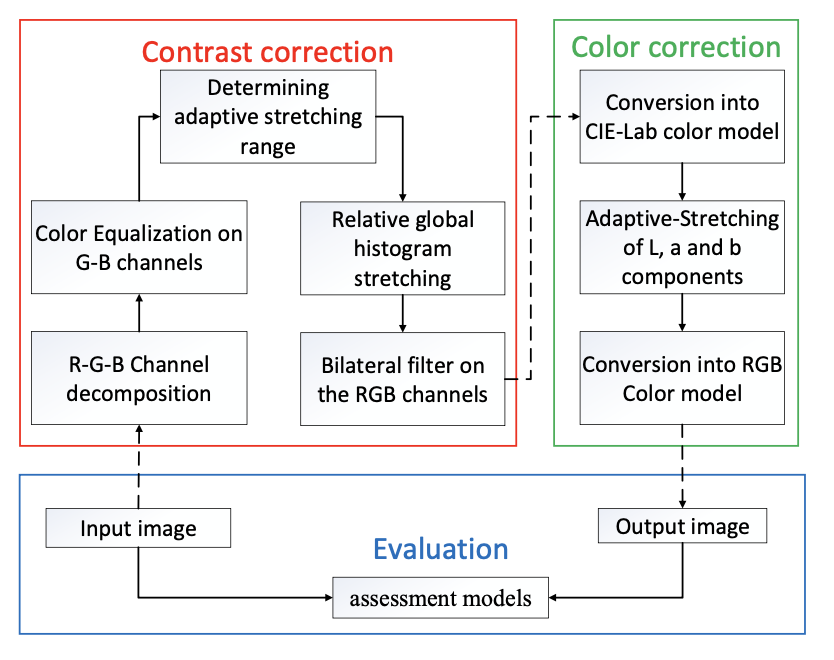

# Implementation of Shallow-water Image Enhancement Using Relative Global Histogram Stretching Based on Adaptive Parameter Acquisition.



# Method
Relative Global Histogram Stretching consists of two methods Contrast correction and Color correction, 
The main.py file first performs Contrast correction, and then performs Color correction sequentially. 
Refer to https://hal-amu.archives-ouvertes.fr/hal-01632263/file/Shallow-water_cameraready.pdf for more details.


# Requirements

`pip install -r requirements.txt`

Python>=3

# Download Dataset
Please go to /data and follow the steps in README.md to download and setup the dataset.
Put the downloaded dataset folder in /data.

# Run the Algorithm !!

`cd src`

To run the algorithm on a full dataset, and store all the images, run:

`python main.py --dataset=raw_sample --save_output=True `

All the output images will be saved in /outputs/raw_sample


To run the algorithm for single image with a path run:

`python main_multi_proc.py --single --save_output --img_path='/path/to/image' `

output will be stored in /outputs/single_image/

To run the algorithm for a dataset and perform evaluation run:

`python main_multi_proc.py --dataset=raw_sample --gt=raw_ref_sample --do_eval --save_output`

It will save the outputs in /output/raw_sample and print the result for the following evaluation metrics : ENTROPY, UCIQE, MSE and, PSNR. 


# Results

## Qualitative analysis:
Output of all the 890 image samples from the dataset are uploaded at https://bit.ly/3G2qFEW

## Quantative analysis:

|Method| ENTROPY | UCIQE |MSE | PSNR |
|  :--- | :---: | :---: | :---:| :---: |
|RGHS| 6.85 | 0.64 | 89.03 | 19.40 |


# Citation
```
@inproceedings{huang:hal-01632263,
  TITLE = {{Shallow-water Image Enhancement Using Relative Global Histogram Stretching Based on Adaptive Parameter Acquisition}},
  AUTHOR = {Huang, Dongmei and Wang, Yan and Song, Wei and Sequeira, Jean and Mavromatis, S{\'e}bastien},
  URL = {https://hal-amu.archives-ouvertes.fr/hal-01632263},
  BOOKTITLE = {{24th International Conference on Multimedia Modeling - MMM2018}},
  ADDRESS = {Bangkok, Thailand},
  YEAR = {2018},
  MONTH = Feb,
  KEYWORDS = {Adaptive parameter acquisition ; Shallow-water image enhancement ; Relative global histogram stretching (RGHS)},
  PDF = {https://hal-amu.archives-ouvertes.fr/hal-01632263/file/Shallow-water_cameraready.pdf},
  HAL_ID = {hal-01632263},
  HAL_VERSION = {v1},
}
```
